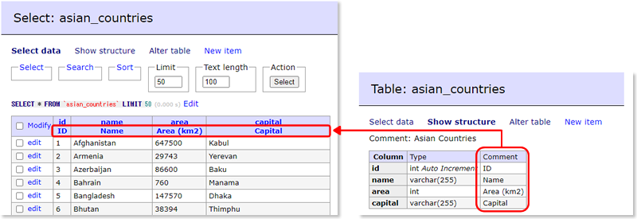
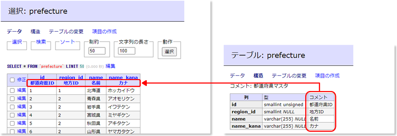

# adminer-show-column-comment

日本語の説明は下にあります。（Japanese explanation is the below.）

# Adminer Plugin - Show column comments in the result headers

Adminer plugin to show column comments in the headers of selected results.

This plugin is available in the page that displays the default result of single table.

## How to intall plugin

1. Just install Adminer PHP plugin.

# Adminer Plugin - カラムコメントを選択結果のヘッダに表示する

SELECT結果のヘッダにカラムコメントを表示します。

このプラグインはデフォルトの単一SELECT結果のページでのみ有効です。

## インストール方法

1. Adminerのプラグイン設置方法に従ってインストールします。
